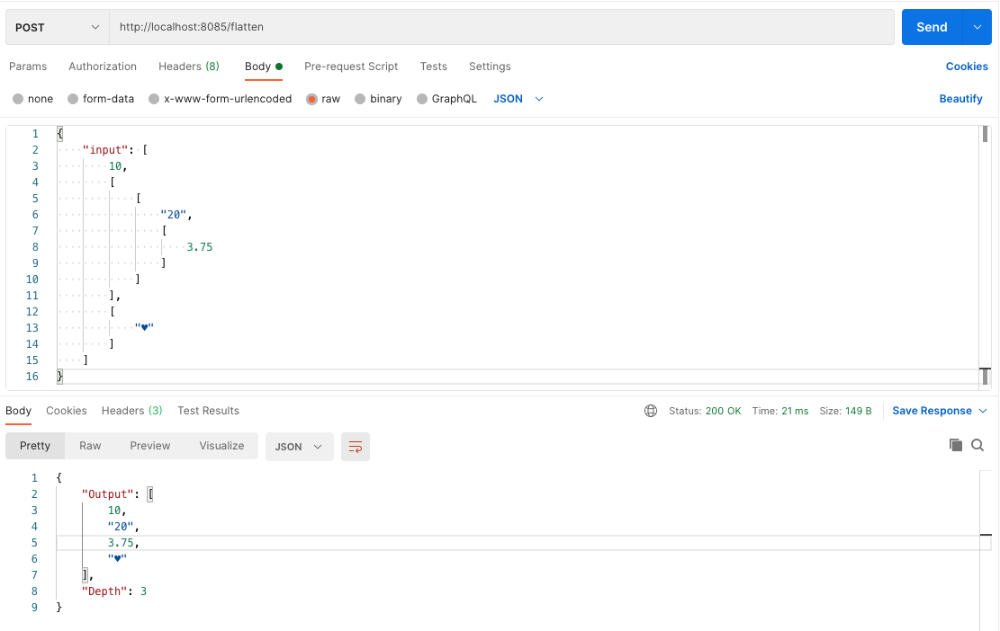
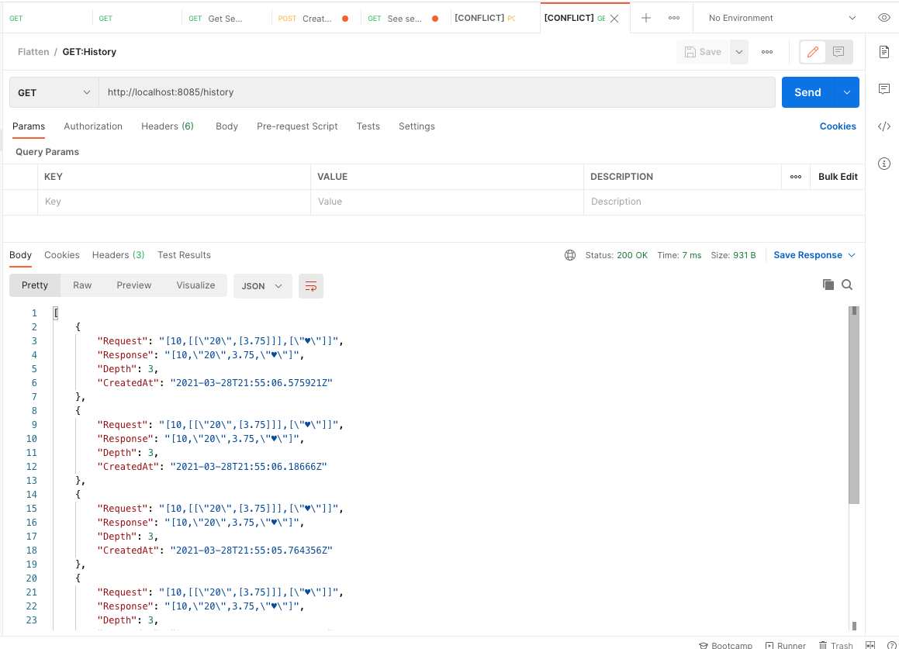

# Flatten Service

Service that will flatten an input arrat of arbitrarily nested arrays of values (of mixed types) into a flat array of values,
and give the level of the deepest element in the array.

Add a list of the last 100 successfully processed requests. Each entry of the list provide the next information:
- the input array
- depth of the original input array

## Screenshots

POST : http://localhost:8085/flatten



GET: http://localhost:8085/history




# Run the project

Only you will need execute:

```bash
make up
```

# Run tests

You can execute test with the next command:

```bash
make test
```

# Makefile

Up the service:

```bash
make up
```

Down the service:

```bash
make down
```

See status containers:

```bash
make ps
```

Execute tests:

```bash
make test
```

# Docker

We have an unique docker file for development and production environments using multi-stage builds:

- Stage `builder` with golang image to can compile and execute tests (docker-compose use this stage).
- Stage `production` with alpine image with binaries generated in `builder` stage.

Note: we are using `upx` (see https://github.com/upx/upx) in the docker file to compress binary files generated.